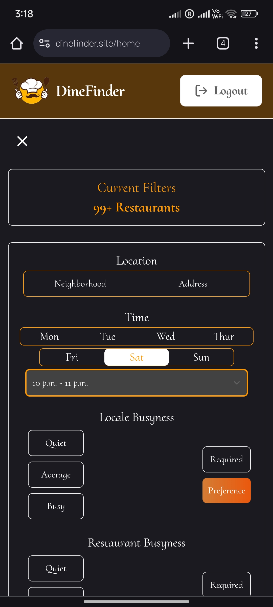
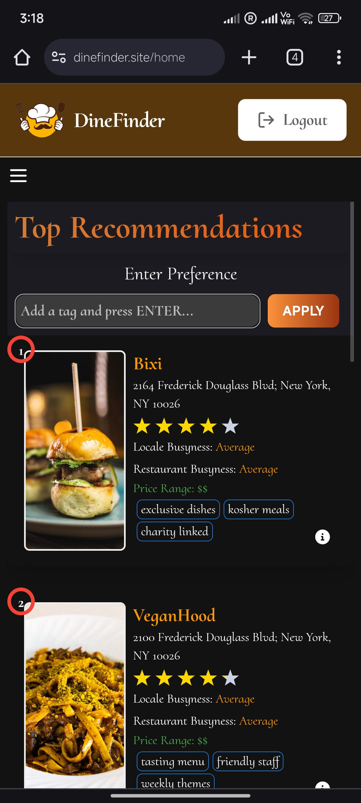
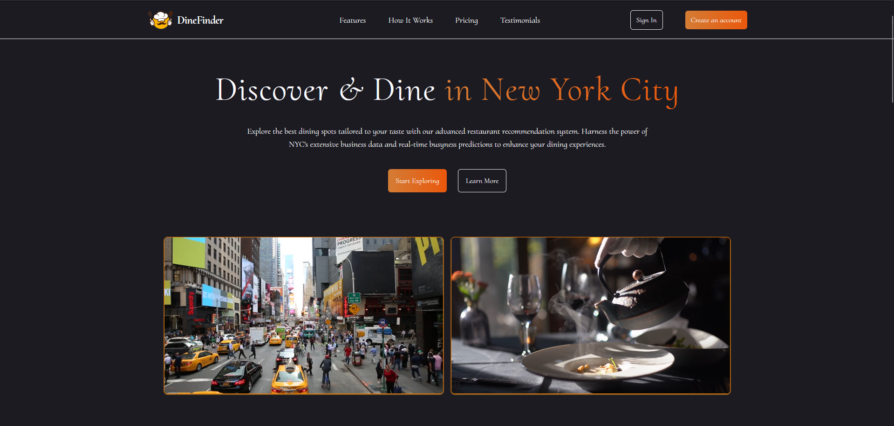
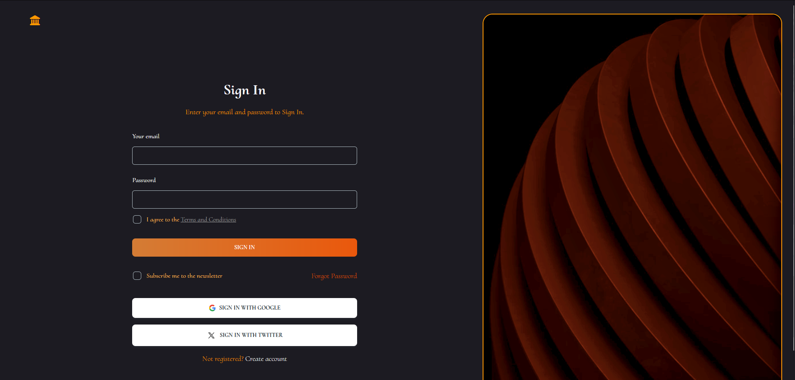
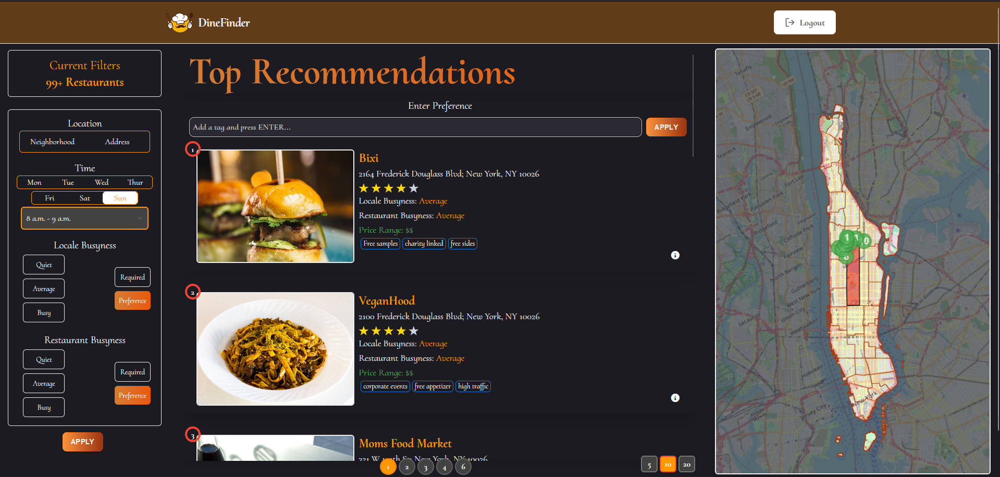

    

# Dine Finder - A Restaurant Recommendation System Web App

## GitHub Badges

| Backend | Frontend |
| --- | --- |
|  |  |
|  |  |
|  |  |
|  |  |

## Commit History

| Backend | Frontend |
| --- | --- |
|  |  |
|  |  |

# DineFinder 

DineFinder is a restaurant recommendation system designed to help you find the best dining spots in Manhattan, New York City. Leveraging historical taxi trip data, advanced machine learning techniques, and real-time busyness predictions, DineFinder ensures you can avoid crowded restaurants and have a delightful dining experience.

## Table of Contents
- [DineFinder](#dinefinder)
  - [Table of Contents](#table-of-contents)
  - [Tech Stack Badges](#tech-stack-badges)
  - [Introduction](#introduction)
  - [Features](#features)
  - [Gallery](#gallery)
    - [Mobile View](#mobile-view)
    - [Desktop View](#desktop-view)
  - [What Makes Us Unique](#what-makes-us-unique)
  - [Technologies Used](#technologies-used)
  - [Working Videos](#working-videos)
    - [Mobile Working Video](#mobile-working-video)
    - [Desktop Working Video](#desktop-working-video)

## Tech Stack Badges 

## Introduction
Manhattan is known for its diverse culinary scene, but choosing the right restaurant can be overwhelming. DineFinder simplifies this process by providing real-time restaurant busyness predictions and personalized recommendations based on user preferences and sentiment analysis of reviews. Whether you're a local or a visitor, DineFinder enhances your dining experience by guiding you to the best times and locations for your meals.

## Features
- **Real-Time Busyness Predictions**: Avoid crowded restaurants with up-to-date occupancy data.
- **Personalized Recommendations**: Get suggestions tailored to your tastes based on review sentiment analysis.
- **Tag-Based Search**: Use tags generated from reviews to find restaurants matching your specific preferences.
- **Interactive Maps**: Visualize restaurant locations and busyness levels on dynamic maps.
- **Sentiment Analysis**: Understand the overall sentiment towards restaurants from aggregated review data.

## Gallery

### Mobile View 

    
    
    
    

### Desktop View 

    
    
    

## What Makes Us Unique
- **Historical Taxi Data**: Utilizes taxi trip data to predict restaurant busyness.
- **Advanced ML Models**: Combines Google BERT for NLP tasks and XGBoost for predictive modeling.
- **User-Centric Design**: Focuses on enhancing user experience with a friendly interface and intuitive navigation.
- **Comprehensive Dataset**: Integrates various data sources to provide accurate and reliable recommendations.

## Technologies Used
- **Backend**: Flask, Gunicorn, NGINX
- **Frontend**: React, Vite, Tailwind CSS, Leaflet, Chart.js, Material UI
- **Database**: MySQL, SQLAlchemy
- **Machine Learning**: Google BERT, XGBoost
- **CI/CD**: GitHub Actions, Docker

## Working Videos

### Mobile Working Video 

  <video width="400" controls autoplay muted>
    <source src="./videos/mobile.mp4" type="video/mp4">
    Your browser does not support the video tag.
  </video>

### Desktop Working Video 

  <video width="1000" controls autoplay muted>
    <source src="./videos/desktop2.mp4" type="video/mp4">
    Your browser does not support the video tag.
  </video>

---

Made with ❤️ by Group 10: Mohammed Musaddique, Haoyu Zheng, Barry Carmody, Bhargav Nikumbh
